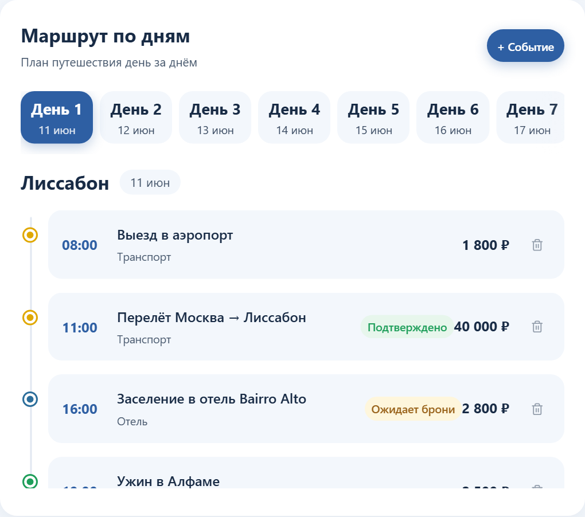
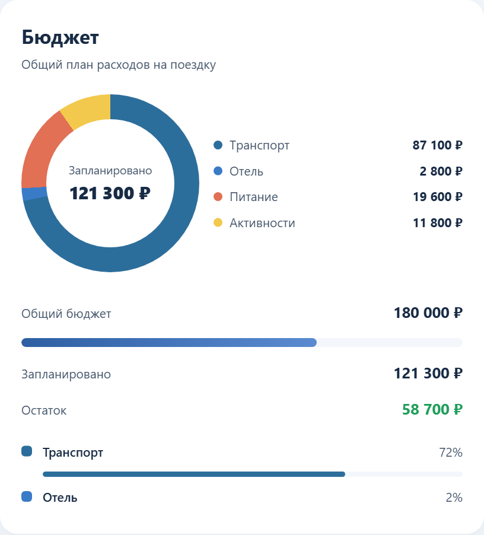
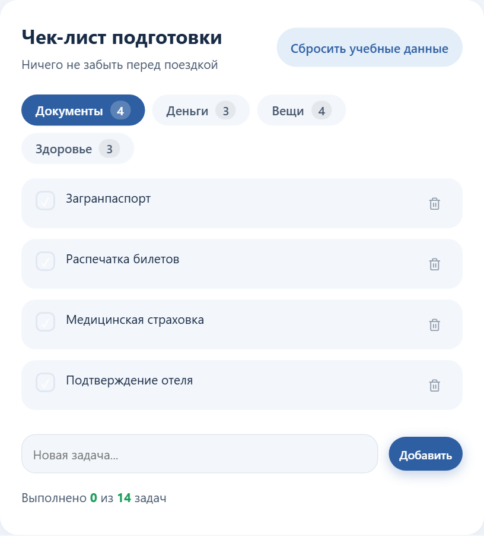
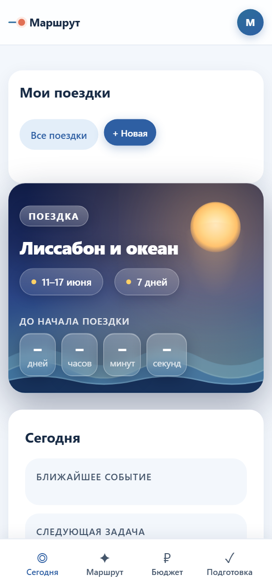

# Маршрут — планировщик путешествия

Веб-приложение, которое собирает поездку в одном месте: план по дням, бюджет, бронирования и чек-лист подготовки. Работает в браузере, без регистрации и без интернета после первой загрузки.

**Живая демонстрация:** https://yaroslava-111.github.io/marshrut/app/

Этот файл написан для человека, который впервые видит репозиторий: как установить проект с нуля, запустить, проверить, сделать резервную копию, обновить и что делать, если что-то не работает.

---

## 1. Что делает сервис и для кого он создан

При подготовке поездки информация расползается: маршрут в заметках, билеты в почте, бюджет в таблице, список вещей в мессенджере. Перед вылетом приходится всё это собирать заново и всё равно что-то забывать.

«Маршрут» держит поездку целиком в одном экране: что происходит в каждый день, сколько уже потрачено и сколько осталось, какие брони подтверждены, что ещё не собрано в дорогу. В день отъезда мобильный режим «Сегодня» показывает только ближайшее событие и следующую задачу.

Для кого:

- **самостоятельные путешественники**, которые планируют поездку без турагентства;
- **пары и семьи** — общий план, бюджет и список вещей вместо переписки;
- **организатор поездки в группе** — один план, по которому сверяются остальные.

### Возможности

- **Обложка поездки** — анимированная заставка с названием, датами и обратным отсчётом до начала.
- **Маршрут по дням** — таймлайн событий с временем, стоимостью и категориями: транспорт, жильё, питание, активности.
- **Переключатель темпа** — «Спокойно» или «Насыщенно»: план дня и расчётная стоимость меняются вместе с выбором.
- **Бюджет** — круговая диаграмма расходов по категориям, прогресс относительно общей суммы и подсветка превышения.
- **Бронирования** — карточки авиабилетов, отелей, поездов и экскурсий со статусом «Подтверждено» или «Ожидает брони».
- **Чек-лист подготовки** — документы, деньги, вещи, здоровье; виден прогресс, можно добавлять свои пункты.
- **Несколько поездок** — создание, переключение и удаление; демонстрационную поездку можно вернуть к исходному виду.
- **Мобильный режим «Сегодня»** — ближайшее событие и следующая задача крупно, с нижней панелью навигации.

---

## 2. Интерфейс

Обложка поездки: название, даты, продолжительность и обратный отсчёт до вылета.


Маршрут по дням: переключатель дней и таймлайн событий со стоимостью и статусом брони.



Бюджет: распределение расходов по категориям и остаток.



Чек-лист подготовки с прогрессом по разделам.



Мобильный вид, режим «Сегодня».



---

## 3. Системные требования

| Что нужно | Версия | Зачем |
|---|---|---|
| Браузер Chrome, Edge, Firefox или Safari | Chrome/Edge 90+, Firefox 90+, Safari 15+ | Сам сервис |
| Git | любая актуальная | Склонировать репозиторий |
| Python | 3.8 и новее | Только для локального сервера (способ 2) |

Операционная система — любая: Windows, macOS, Linux. Сервер, база данных, Node.js и сборка не нужны. Приложение рассчитано и на телефон: вёрстка адаптируется начиная с ширины 360 пикселей.

---

## 4. Установка с чистого компьютера

### 4.1. Установите Git

- **Windows:** скачайте установщик с https://git-scm.com/download/win и пройдите его с настройками по умолчанию.
- **macOS:**

  ```bash
  xcode-select --install
  ```

- **Linux (Ubuntu/Debian):**

  ```bash
  sudo apt update && sudo apt install -y git
  ```

Проверьте установку:

```bash
git --version
```

### 4.2. Склонируйте репозиторий

```bash
git clone https://github.com/Yaroslava-111/marshrut.git
cd marshrut
```

### 4.3. Установите зависимости

Зависимостей нет. Приложение — три файла в папке `app/`, без библиотек и сборки. Виртуальное окружение Python и `npm install` не требуются: такого шага в проекте нет намеренно.

---

## 5. Запуск

### Способ 1. Открыть файл в браузере

Откройте `app/index.html` двойным щелчком.

### Способ 2. Локальный сервер (рекомендуется)

Так поездки гарантированно сохраняются между запусками: часть браузеров ограничивает хранилище для страниц, открытых по `file://`. Из корневой папки проекта:

```bash
python -m http.server 8000
```

Если команда `python` не найдена:

```bash
python3 -m http.server 8000
```

Откройте в браузере:

```text
http://localhost:8000/app/
```

Обратите внимание на `/app/` в конце адреса. Остановить сервер — `Ctrl + C` в терминале.

---

## 6. Проверка работоспособности

Автотестов в проекте нет — проверка выполняется вручную за пять минут на демонстрационной поездке «Лиссабон и океан», которая создаётся при первом открытии.

### 6.1. Главный пользовательский сценарий

1. Откройте приложение любым способом из раздела 5.
   **Ожидаемый результат:** видна обложка поездки «Лиссабон и океан», даты и работающий обратный отсчёт.
2. Прокрутите до блока **«Темп путешествия»** и переключите его на **«Насыщенно»**.
   **Ожидаемый результат:** состав событий в маршруте изменился, расчётная стоимость пересчиталась.
3. В блоке **«Маршрут по дням»** выберите **«День 3»**.
   **Ожидаемый результат:** открылся таймлайн третьего дня с другим городом и своими событиями.
4. Нажмите **«+ Событие»**, добавьте любое событие со временем и стоимостью.
   **Ожидаемый результат:** событие встало в таймлайн по времени, сумма в блоке «Бюджет» выросла.
5. Откройте блок **«Бюджет»**.
   **Ожидаемый результат:** диаграмма и разбивка по категориям соответствуют событиям маршрута.
6. В **чек-листе подготовки** отметьте любой пункт.
   **Ожидаемый результат:** прогресс раздела увеличился.
7. Обновите страницу клавишей `F5`.
   **Ожидаемый результат:** добавленное событие и отметка в чек-листе на месте — значит, сохранение работает.
8. Уменьшите окно браузера до ширины телефона (или откройте на телефоне).
   **Ожидаемый результат:** появилась нижняя панель и экран «Сегодня».

Если все восемь шагов прошли как описано, приложение исправно.

---

## 7. Переменные окружения

Переменных окружения в проекте **нет**, файла `.env` тоже нет. Приложение не обращается к внешним сервисам: ключи, токены и пароли ему не нужны. Карты, курсы валют и системы бронирования не подключаются — все данные вводит пользователь.

Демонстрационная поездка задана в объекте `TRIP_DEMO` в начале файла `app/app.js`. Там же меняются её даты, города, события и бронирования.

---

## 8. Структура проекта

```text
marshrut/
├── app/
│   ├── index.html      # Разметка всех экранов приложения
│   ├── styles.css      # Стили, анимация обложки, адаптивность
│   └── app.js          # Логика: поездки, маршрут, бюджет, чек-лист, хранение
├── screenshots/        # Скриншоты для этого файла
└── README.md
```

---

## 9. Публикация

Проект — статический сайт, публикуется бесплатно на GitHub Pages.

Публикация уже включена, адрес: https://yaroslava-111.github.io/marshrut/app/

Как включить её в своей копии репозитория:

1. Репозиторий на GitHub → **Settings** → **Pages**.
2. **Build and deployment** → источник **Deploy from a branch**.
3. Ветка `main`, папка `/ (root)` → **Save**.
4. Через одну–две минуты приложение доступно по адресу `https://<ваш-логин>.github.io/marshrut/app/`.

Подойдёт и любой другой статический хостинг — Netlify, Vercel, обычный веб-сервер.

Публикация не создаёт общего хранилища поездок: у каждого посетителя свои данные в его собственном браузере.

---

## 10. Обновление

В папке проекта:

```bash
git pull
```

Затем обновите страницу сочетанием `Ctrl + F5` (на macOS — `Cmd + Shift + R`).

Опубликованный на GitHub Pages сайт обновляется сам в течение одной–двух минут после отправки изменений в ветку `main`.

Поездки при обновлении **не теряются**: они хранятся в браузере, а не в файлах проекта. Перед обновлением всё же сделайте резервную копию по инструкции из раздела 11.

---

## 11. Резервное копирование и восстановление

Поездки хранятся в браузере, в хранилище `localStorage`, под двумя ключами:

| Ключ | Что содержит |
|---|---|
| `marshroot-trips` | Все поездки: дни, события, бюджет, бронирования, чек-лист |
| `marshroot-active-trip` | Какая поездка открыта сейчас |

Кнопки экспорта в интерфейсе нет, поэтому копия делается через консоль браузера.

### Сделать резервную копию

1. Откройте приложение, нажмите `F12` → вкладка **Console**.
2. Вставьте команду и нажмите `Enter`:

   ```javascript
   copy(localStorage.getItem('marshroot-trips'))
   ```

3. Данные скопированы в буфер обмена — вставьте их в файл и сохраните, например `marshrut-backup.json`.

### Восстановить из копии

1. Откройте приложение, нажмите `F12` → **Console**.
2. Выполните команду, подставив содержимое файла вместо `СОДЕРЖИМОЕ_ФАЙЛА_КОПИИ`:

   ```javascript
   localStorage.setItem('marshroot-trips', 'СОДЕРЖИМОЕ_ФАЙЛА_КОПИИ')
   ```

3. Обновите страницу — поездки вернутся.

Тем же способом поездка переносится на другой компьютер: скопировали на одном, вставили на другом.

---

## 12. Известные ограничения

- **Данные живут только в одном браузере.** Синхронизации между устройствами и совместного доступа нет; очистка данных сайта удаляет поездки безвозвратно.
- **Нет кнопки экспорта и импорта** — резервная копия делается через консоль браузера (раздел 11).
- **Демонстрационная поездка датирована июнем 2027 года.** Когда эта дата пройдёт, обратный отсчёт на обложке будет показывать прочерки. Исправляется заменой дат в объекте `TRIP_DEMO` в файле `app/app.js`.
- **Нет интеграций:** карты, авиабилеты, отели, курсы валют не подключены, события и цены вводятся вручную.
- **Бюджет в одной валюте** — пересчёт по курсу не поддерживается.
- **Нет совместного редактирования.** Спутники не смогут править план одновременно с вами.
- **Нет напоминаний и уведомлений** о ближайших событиях.
- **Чек-лист и бронирования не прикрепляют файлы** — посадочные талоны и ваучеры хранятся отдельно.

---

## 13. Если что-то не работает

| Что вы видите | Причина | Что сделать |
|---|---|---|
| Поездка сбрасывается после перезагрузки | Страница открыта по `file://`, браузер ограничил хранилище | Запустите локальный сервер — способ 2 в разделе 5 |
| 404 при открытии `http://localhost:8000` | Сервер запущен из корня, а приложение лежит в `app/` | Откройте `http://localhost:8000/app/` |
| В обратном отсчёте прочерки | Дата начала поездки уже прошла | Измените даты поездки или поправьте `TRIP_DEMO` в `app/app.js` |
| Страница без стилей и анимации | Не загрузился `styles.css` | Проверьте, что `styles.css` и `app.js` лежат рядом с `index.html` в папке `app/`; выполните `git status` |
| Бюджет не сходится с событиями | Включён другой темп путешествия | Переключите «Спокойно» / «Насыщенно» — у режимов разный состав событий |
| Демонстрационная поездка «испортилась» после экспериментов | Изменены демонстрационные данные | Нажмите кнопку возврата демонстрационной поездки к исходному виду в блоке поездок |
| `python: command not found` | Python не установлен или называется `python3` | Выполните `python3 -m http.server 8000` или установите Python с https://www.python.org/downloads/ |
| `Address already in use` | Порт 8000 занят | Запустите на другом порту: `python -m http.server 8080` |

### Где смотреть журнал ошибок

Своих файлов журнала у приложения нет. Все ошибки видны в браузере: `F12` → вкладка **Console**. Фактическое содержимое хранилища — там же, на вкладке **Application** → **Local Storage**.

---

## 14. Поддержка

Вопросы, замечания и сообщения об ошибках — через раздел **Issues** этого репозитория: https://github.com/Yaroslava-111/marshrut/issues

Автор проекта: https://github.com/Yaroslava-111
