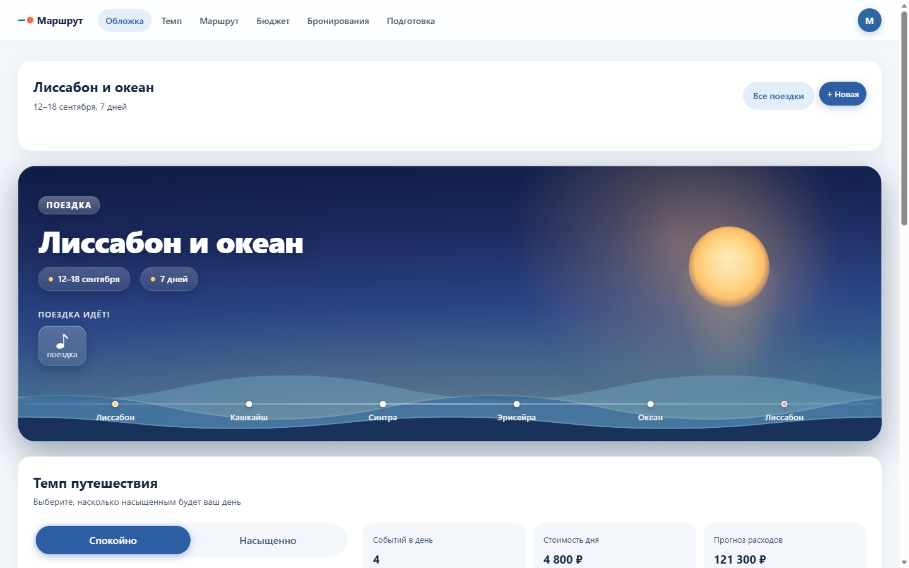
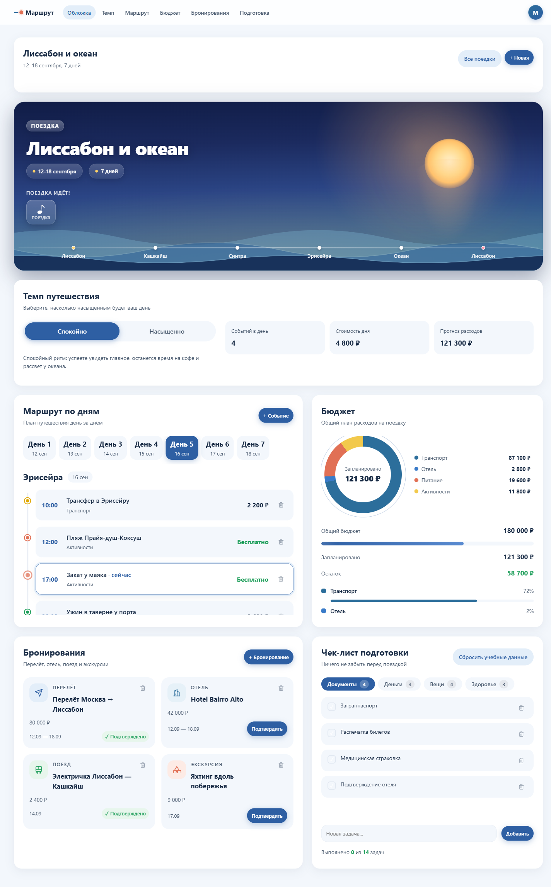

# Маршрут

Адаптивное веб-приложение для планирования путешествий с бюджетом, расписанием и чек-листом подготовки.

## Задача

При планировании поездки приходится держать в голове маршрут, бюджет, бронирования и список вещей — всё разрозненно в заметках и чатах. «Маршрут» собирает это в одно مكان с красивой подачей и адаптацией под мобильные устройства.

## Результат

Полноценный планировщик поездок с:

- **Обложкой поездки** — анимированный Hero с океанскими волнами, солнцем и обратным отсчётом до начала
- **Дневным маршрутом** — таймлайн событий по дням с категориями (транспорт, жильё, еда, активности)
- **Переключателем темпа** — «Спокойно» или «Насыщенно» с автоматическим пересчётом стоимости
- **Бюджетом** — круговая диаграмма расходов, прогресс-бар, разбивка по категориям с индикацией превышения
- **Бронированиями** — карточки авиабилетов, отелей, поездов и экскурсий с подтверждением и удалением
- **Чек-листом подготовки** — документы, деньги, вещи, здоровье с прогрессом и возможностью добавить свои задачи
- **Несколькими поездками** — создание, переключение и удаление поездок
- **Мобильным режимом «Сегодня»** — фокус на ближайшем событии и следующей задаче

Приложение полностью офлайн, работает в браузере без сервера.

## Скриншоты



*Анимированная обложка поездки с обратным отсчётом.*



*Маршрут по дням, бюджет и бронирования на десктопе.*


*Мобильный режим «Сегодня» с фокусом на ближайшем событии.*

## Стек

| Технология | Роль |
|---|---|
| HTML5 | Семантическая разметка |
| CSS3 | Стили, анимации, адаптивность |
| JavaScript | Логика приложения |
| localStorage | Хранение данных |

Без фреймворков, сборщиков и внешних зависимостей.

## Как запустить

Откройте `app/index.html` в браузере — приложение готово к работе.

## Структура проекта

```
app/
├── index.html   # Разметка
├── styles.css   # Стили и анимации
└── app.js       # Логика приложения
```
